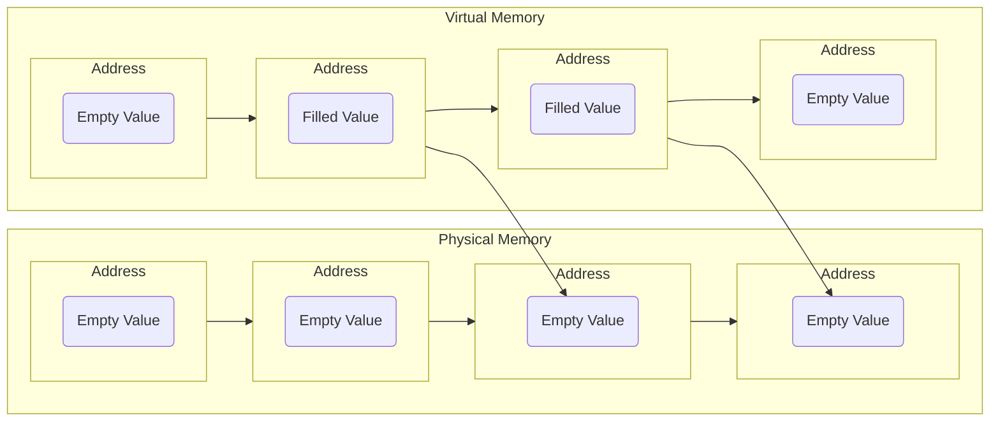
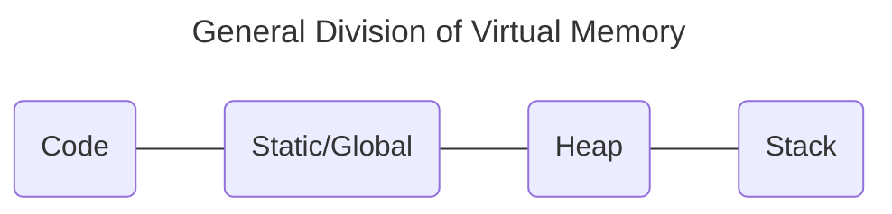

# Lecture 1 Intro to C and Memory

#### Introduction to C


#### Introduction to Memory
Memory in a computer can be imagined as a table.

|Address   |0x0000|0x0001|0x0002|...     |Physical Limit|
|----------|------|------|------|--------|--------------|
|**Values**|      |      |      |        |              |

Every addressable part of memory is 1 byte. In other words, the size of the amount of data that is stored in each address is 1 byte. 

1 byte = 8 bits 
8 bits = ==00000000==

Note that ==00000000== is a bit pattern (a bit pattern is a representation of binary data), and this bit pattern can mean anything (e.g. 0, 27, -5). Simply put, we can assign a meaning to this bit pattern, which is then stored in memory.

###### Placement of Memory
For understanding purposes, say we declare a variable:
```
int x = 8
```
The computer must determine how big `int` is. This depends on the architecture of a computer because on a 32 bit machine, the size of `int` would be 32 bits, and on a 64 bit machine, the size of `int` is 64 bits. 

For this explanation, let us assume that we are running a 32 bit machine. Hence, `int` would be 4 bytes large. Going back, the imagined 'memory table' would look as follows, where X marks the storage of the `int`.

|Address   |0x0000|0x0001|0x0002|0x0003|0x0004|...     |Physical Limit|
|----------|------|------|------|------|------|--------|--------------|
|**Values**|      |X     |X     |X     |X     |        |              |

Realistically, memory in a computer is split into two types, Physical Memory and Virtual Memory. This can be imagined in two different tables.

For Physical Memory
|Address   |0x0000|0x0001|0x0002|0x0003|0x0004|...     |$2^{25+}$</br>(32GB)|
|----------|------|------|------|------|------|--------|--------------------|
|**Values**|      |      |      |      |      |        |                    |

For Virtual Memory
|Address   |0x0000|0x0001|0x0002|0x0003|0x0004|...     |$2^{45+}$</br>(33 Million GB)|
|----------|------|------|------|------|------|--------|-----------------------------|
|**Values**|      |      |      |      |      |        |                             |

Obviously, there is not enough storage for such a large range in Virtual Memory, but this is how memory is viewed from the perspective of a program. However, computers come with Operating Systems, and these Operating Systems map regions of Virtual Memory onto Physical Memory. For example, using the declared `int` from before, we store this data in the Virtual Memory. When the `int` is used, the Operating System will copy the memory from the Virtual Memory to the Physical Memory.  



As such, in theory, we do have a "large" amount of memory. By re-assigning and re-organizing memory that is currently being used and not used (done by the Operating System), it allows for a more efficient use of the Physical Memory. 
Note that each program is 'not aware' of this 'juggling' of memory and is run as needed. The Operating System is what 'juggles' the memory.

It is important to note that the Physical Memory does not store the data we intend, but rather, addresses (linked) to that data. This means that somewhere inside the compilation pipeline (where the program is traslated into machine code/code that the computer reads), when we compile the `int x = 8` (Programming Language), we get an address, for example, `0x2048, 8;` (Assembly Language, linking the data `8` to the address).  

Virtual Memory is generally structed in the same way for almost all programmes because its much easier to recognize. There are many other divisions of memory, but he 4 main ones are as follows.


