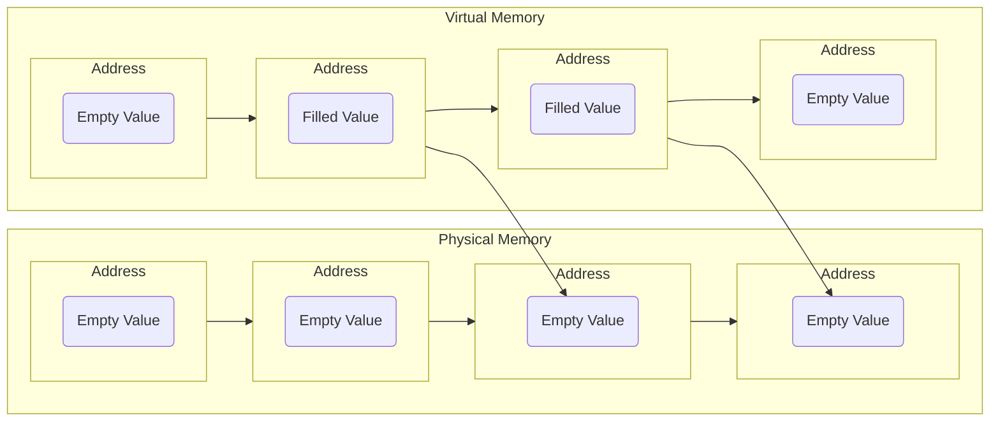
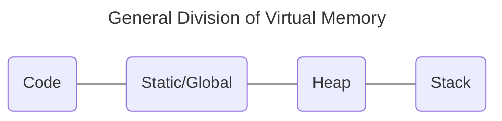

# Lecture 1 Intro to C and Memory

#### Introduction to Memory
Memory in a computer can be imagined as a table.

|Address   |0x0000|0x0001|0x0002|...     |Physical Limit|
|----------|------|------|------|--------|--------------|
|**Values**|      |      |      |        |              |

Every addressable part of memory is 1 byte. In other words, the size of the amount of data that is stored in each address is 1 byte.

1 byte = 8 bits
8 bits = **00000000**

Note that **00000000** is a bit pattern (a bit pattern is a representation of binary data), and this bit pattern can mean anything (e.g. 0, 27, -5). Simply put, we can assign a meaning to this bit pattern, which is then stored in memory.

A more specific visual representation of the memory occupied by an `int` can be seen in the table below:

Memory Address    | Content
------------------|--------
0x00000000        | [Byte 1]
0x00000001        | [Byte 2]
0x00000002        | [Byte 3]
0x00000003        | [Byte 4]


Memory Address    | Content
------------------|--------
0x00000000        | 00101010 (Binary representation of 42)
0x00000001        | 00000000
0x00000002        | 00000000
0x00000003        | 00000000

A breakdown of the possible values that can be represented by **one byte** is as follows:
- Binary: 00000000 to 11111111
- Decimal: 0 to 255
- Hexadecimal: 00 to FF

While the size of each datatype varies by build (physical build),
- char: 1 byte
- short: 2 bytes
- int: 4 bytes
- long: 4 or 8 bytes
- long long: 8 bytes
- float: 4 bytes
- double: 8 bytes
- long double: Can vary (commonly 8 or 16 bytes)
- Pointers
    - On 32-bit systems: 4 bytes
    - On 64-bit systems: 8 bytes


###### Placement of Memory
For understanding purposes, say we declare a variable:
```
int x = 8
```
The computer must determine how big `int` is. This depends on the architecture of a computer because on a 32 bit machine, the size of `int` would be 32 bits, and on a 64 bit machine, the size of `int` is 64 bits.

For this explanation, let us assume that we are running a 32 bit machine. Hence, `int` would be 4 bytes large. Going back, the imagined 'memory table' would look as follows, where X marks the storage of the `int`.

|Address   |0x0000|0x0001|0x0002|0x0003|0x0004|...     |Physical Limit|
|----------|------|------|------|------|------|--------|--------------|
|**Values**|      |X     |X     |X     |X     |        |              |

Realistically, memory in a computer is split into two types, Physical Memory and Virtual Memory. This can be imagined in two different tables.

For Physical Memory
|Address   |0x0000|0x0001|0x0002|0x0003|0x0004|...     |$2^{25+}$</br>(32GB)|
|----------|------|------|------|------|------|--------|--------------------|
|**Values**|      |      |      |      |      |        |                    |

For Virtual Memory
|Address   |0x0000|0x0001|0x0002|0x0003|0x0004|...     |$2^{45+}$</br>(33 Million GB)|
|----------|------|------|------|------|------|--------|-----------------------------|
|**Values**|      |      |      |      |      |        |                             |

Obviously, there is not enough storage for such a large range in Virtual Memory, but this is how memory is viewed from the perspective of a program. However, computers come with Operating Systems, and these Operating Systems map regions of Virtual Memory onto Physical Memory. For example, using the declared `int` from before, we store this data in the Virtual Memory. When the `int` is used, the Operating System will copy the memory from the Virtual Memory to the Physical Memory.



As such, in theory, we do have a "large" amount of memory. By re-assigning and re-organizing memory that is currently being used and not used (done by the Operating System), it allows for a more efficient use of the Physical Memory. 
Note that each program is 'not aware' of this 'juggling' of memory and is run as needed. The Operating System is what 'juggles' the memory.

It is important to note that the Physical Memory does not store the data we intend, but rather, addresses (linked) to that data. This means that somewhere inside the compilation pipeline (where the program is traslated into machine code/code that the computer reads), when we compile the `int x = 8` (Programming Language), we get an address, for example, `0x2048, 8;` (Assembly Language, linking the data `8` to the address `0x2048`).

Virtual Memory is generally structed in the same way for almost all programmes because its much easier to recognize. There are many other divisions of memory, but he 4 main ones are as follows.




#### Introduction to C
Unlike Python, the C language is highly customizable. This also means that things that are usually omitted in python, like basic functions/commands, must be included when initializing code. Note that **Data Types is NOT covered here**.

A 'Hello World!' program for C is written as:
```
#include <stdio.h>

int main() {
  printf("Hello World!");
  return 0;
}
```
###### Breakdown and Explanation

At the start of any C program, the following code is usually added:
```
#include <stdio.h>
```
Similar to the import in python, the `#include` is a 'function' (professionally known as a preprocessor directive) that basically means that the program will go through the downloaded C language installed on a computer and allow you to use functions from the specified library.

Its like telling the computer to 'include' a certain file (that contains functions), professionally called a library, in the current file such that functions from that file can be used.

The `<>` indicates that the file to be 'imported' (included) is a file that is in the standard system directory (the installed C language itself).

The `stdio.h` stands for Standard Input/Output Header. This is a library, a file with functions, located inside the standard system directory, like its name, contains standard functions used in coding (with standard inputs and outputs). Because this file contains only functions (it can be said that this file is used to declare functions), and likely other tools useful in coding (this is not the only file like this in the standard system directory, such as files that declare data types, macros, and other declarations), it is labelled as a **header** file. Hence, the `.h` that follows `stdio`.

In more basic terms, a 'direct translation' of the code is: "Include the standard input output header file".

A more 'detailed translation' is: "Include, from the Standard System Directory, the Standard Input/Output Header file".

The `main()` function of a program in the C language is a special function that acts as the entry point of execution of a C program. It is always preceded by an `int`, this is because the returned `int` value allows for the operating system of the computer to identify that program has run successfully. While, it doesn't necessarily have to return `0`, it is convention to do so.

```
int main() {
    // Code for the main function
    return 0;
}
```

In some cases, the inside of the `main()` function can contain `int argc, char *argv[]` to take in command line arguments.
```
int main(int argc, char *argv[]) {
    // Code for the main function
    return 0;
}
```
`int argc` is the **arg**ument **c**ount of command-line arguments (It is assumed you know how to run a program through a command line, usually by entering: `./my_program arg1 arg2 arg3` in a command line). Hence, it returns an `int` (integer) value. If `./my_program arg1 arg2 arg3`, was entered into the command line, the output of `argc` is 4. Note that `argc` can be replaced with any variable name, `argc` is just for convention and easier readability.

`char *argv[]` is the array of pointer strings in the command-line arguments. It stands for "**arg**ument **v**ector", with 'vector' meaning an 'ordered' array. Because a string is an array of `char`acters, and characters in a certain order gives us legible words or specific inputs, `argv[]` is used to represent the inputs in the command-line arguments as an array. The asterisk, `*`, is what denotes the array as a pointer (a pointer is something, technically a 'variable', that stores the memory address of a variable). Hence, when an input is entered into the command-line, that input is 'stored' in a memory address. Thus, the computer will have to go back to the memory address when referencing the command-line arguments.

Similarly, note that `argv` can be replaced with any variable name, `argv` is just for convention and easier readability (E.g. `*argumentvector[]` instead of `*argv[]` is also possible).
